# Conservative and Adaptive Penalty for Model-Based Safe Reinforcement Learning

## main contributions
* 可以保证训练过程每次迭代安全的可以感知不确定性的惩罚函数
* 可以动态调整训练过程中保守程度的自动更新规则
* 在简单的环境中（离散动作，奖励明确），可以找到零违反下的次优策略。
* 高维状态连续动作环境下，可扩展的CAP实现。
  
  主要解决了训练过程中的安全性。
  
  但是这篇论文主要讨论的是有限状态和动作的环境下这个算法的效果。

## concept
### MBRL
MBRL代表模型基于增强学习（Model-Based Reinforcement Learning）。它是一种强化学习方法，结合了模型学习和策略优化的思想。

在传统的强化学习中，智能体（agent）通过与环境的交互来学习最优策略。然而，这种方法通常需要大量的试错，因为智能体必须不断尝试不同的行动并观察结果。而在MBRL中，智能体首先试图通过学习环境的模型来获得对环境的理解。这个模型可以是一个预测模型，能够预测在给定状态和动作下的下一个状态和奖励。

通过使用模型，智能体可以在内部进行模拟，而不必直接与环境交互。它可以使用模型来尝试各种可能的动作序列，并预测每个序列的结果。然后，智能体可以利用这些预测来选择最佳的动作序列，而无需实际进行试错。

一旦智能体利用模型生成了一系列动作，它就可以将这些动作序列应用于真实环境中进行验证。然后，智能体可以使用从实际环境中收集到的数据来更新和改进其模型，以便更准确地预测环境的动态。

MBRL的优点之一是可以利用模型学习的预测能力，来加速策略搜索和决策制定过程。它可以减少与环境的实际交互次数，从而在采样效率和学习速度上提供优势。然而，MBRL也面临着模型不准确性和不完备性的挑战，因为模型只是对环境的近似表示。因此，在实际应用中，需要平衡模型学习和策略优化的过程，并充分考虑模型的局限性。

### 比例积分控制器
一个比例积分（PI）控制器是一种常见的反馈控制器，用于调节系统的输出以使其接近期望的参考值。它结合了比例控制和积分控制的特性。

比例控制（Proportional Control）是根据当前误差的大小，以比例的方式调节输出。它的基本原理是，当误差增大时，控制器的输出也相应增大，以更大的力度纠正系统的偏差。比例控制对于快速响应和减小稳态误差是有效的，但它无法消除系统的静态误差。

积分控制（Integral Control）是根据误差的累积量来调节输出。它的基本原理是，当系统存在稳态误差时，积分控制器会积累误差，并通过增加输出来减小误差。积分控制对于消除稳态误差是有效的，但它可能导致系统响应变慢或产生过度调节。

PI控制器结合了比例控制和积分控制的优点，通过比例项快速响应，通过积分项减小稳态误差。它的输出是比例项和积分项之和。比例项使得控制器能够快速对系统变化做出响应，而积分项则通过积累误差来减小稳态误差。

PI控制器的数学表示如下：
u(t) = Kp * e(t) + Ki * ∫e(t)dt

其中，u(t)是控制器的输出，Kp是比例增益，e(t)是当前时刻的误差，Ki是积分增益，∫e(t)dt是误差的累积量。

通过适当选择比例增益和积分增益，可以调节PI控制器的性能以满足系统要求，例如快速响应、稳态精度和抗干扰能力。

### IPM
积分概率度量（Integral Probability Metric，IPM）是一种用于衡量概率分布之间差异的度量方法。它广泛应用于概率模型评估、概率生成模型的训练和概率分布匹配等领域。

IPM的基本思想是通过计算两个概率分布之间的距离来衡量它们的相似性或差异性。与传统的度量方法（如Kullback-Leibler散度）不同，IPM基于测度理论的概念，将距离定义为两个分布之间的差异的积分。

IPM的一种常见形式是Wasserstein距离（也称为Earth Mover's Distance），它衡量将一个概率分布转换为另一个所需的最小成本。Wasserstein距离考虑了两个分布之间的匹配关系，而不仅仅是它们的形状或位置差异。它适用于具有不同支撑集的分布，并且在生成模型的训练中具有重要的应用。

IPM具有许多优点，例如它是一种统一的框架，可以适用于不同类型的概率分布，包括连续分布和离散分布。它还具有良好的数学性质，例如可微性和上确界的存在性，使得它在优化和统计推断中具有重要的应用。此外，IPM还可以通过选择不同的核函数或距离度量来适应不同的问题和应用场景。

综上所述，积分概率度量（IPM）是一种用于衡量概率分布之间差异的方法，特别是Wasserstein距离在其中扮演重要角色。它在概率模型评估、生成模型训练和概率分布匹配等领域具有广泛的应用。

## CAP
### tabular
#### conservative penalty
假设Vc属于βF,可以得到引理4.2，因而真实模型和预测模型的策略代价期望可以受（4）约束。
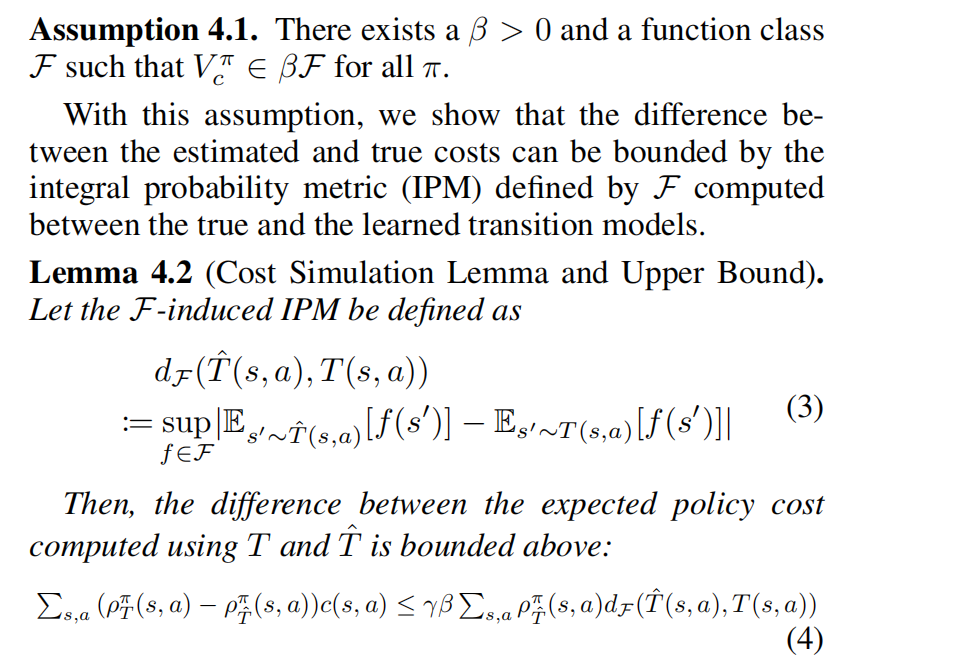

这篇论文的做法就是将真实与预测模型之间的差距加入到代价函数中，得到一个保守的代价约束。

dF的上限为uT
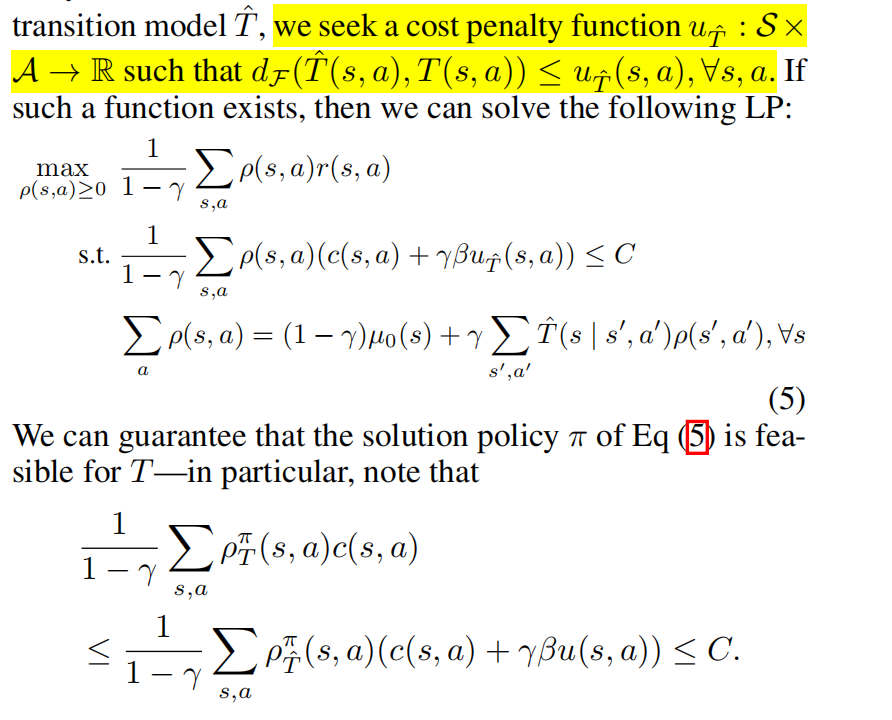

接下来的问题是如何得到u，针对表格环境，作者提出的公式如下：
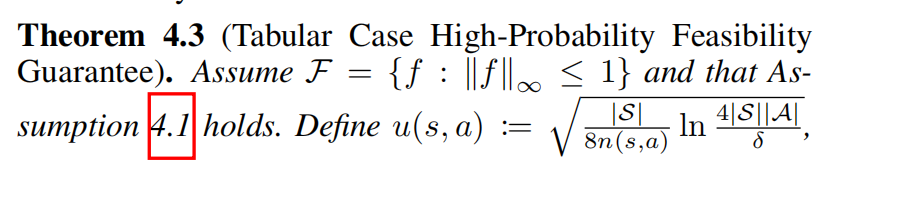
更进一步的，为了中间过程中的策略也是安全的，将当前episode也加入到公式中，得到：
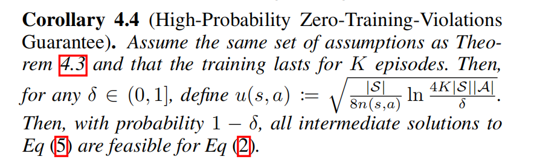

作者在下面又提到了u的实际实现，是比较简单的方法(n表示（s,a）中的个数)
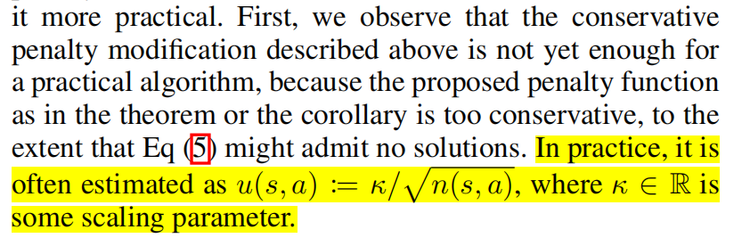

#### Adaptive Cost Penalty
由上面的u的实现引出了k值的设定问题，固定值比较死板，难以得到好的结果，所以就自适应地调整k。k的更新如下：
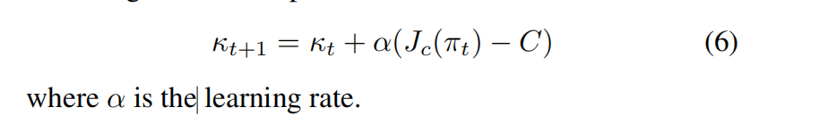
细节上注意要保持k非负

完整的CAP算法流程：
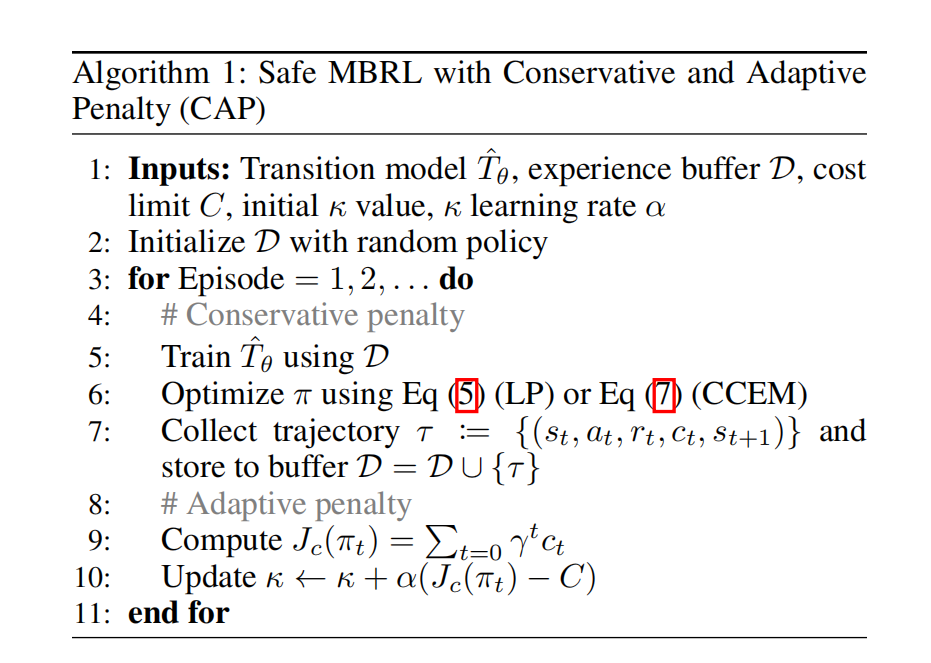

###  CAP for High-Dimensional States
主要基于统计的方法
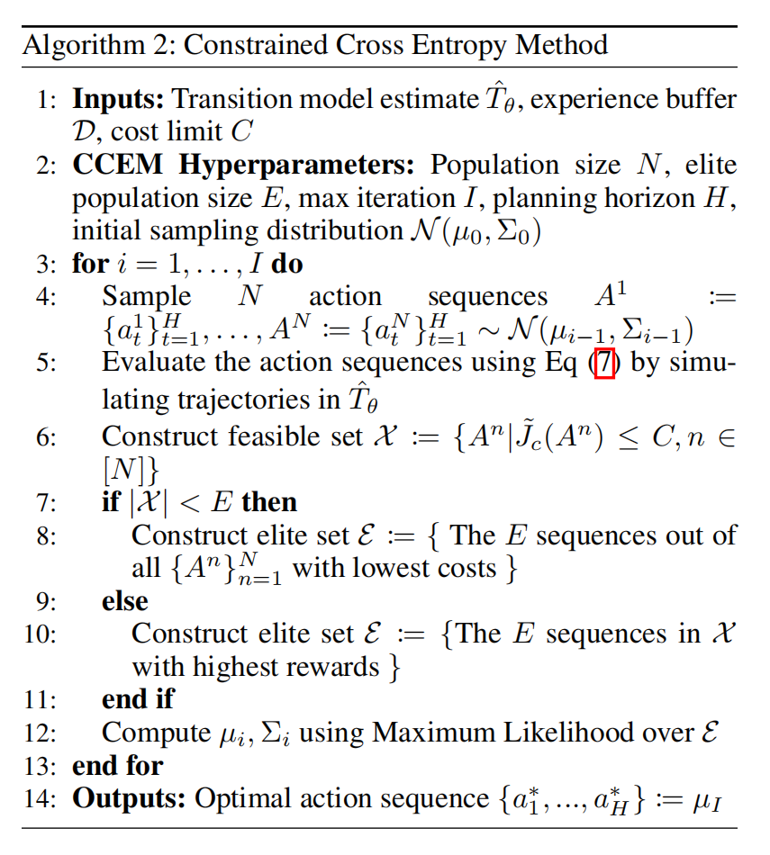
连续空间又分为两种，一个是基于状态的，一个是基于视觉观察的，这两种空间中u的选择也不同。

基于状态：
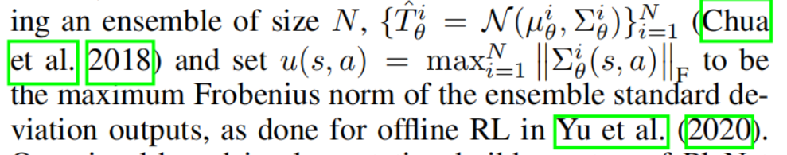

基于视觉观察：
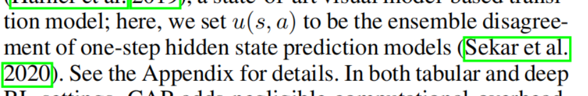

描述的比较简略，甚至都没有说明含义，几句话带过。

但是实验对比主要是在连续空间

## exp
对比试验结果
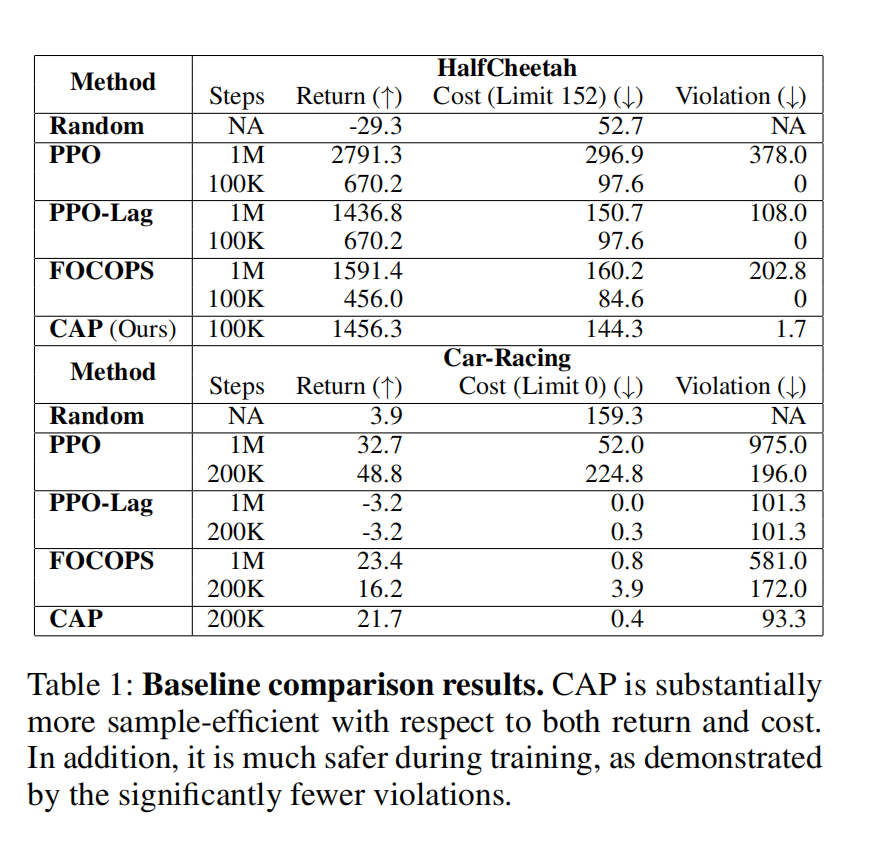
作者和PPO-Lag,FOCOPS进行了对比，实验结果表明CAP收敛得更快并且训练过程中违反限制更少

个人认为实验结果缺乏说服力，就自己的训练情况来看，不同环境对于不同算法的效果不一，未必越先进的效果就越好，这篇文章的测试环境比较少，对比的也少，并且对于连续情况下的实现说明有些简略。