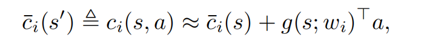
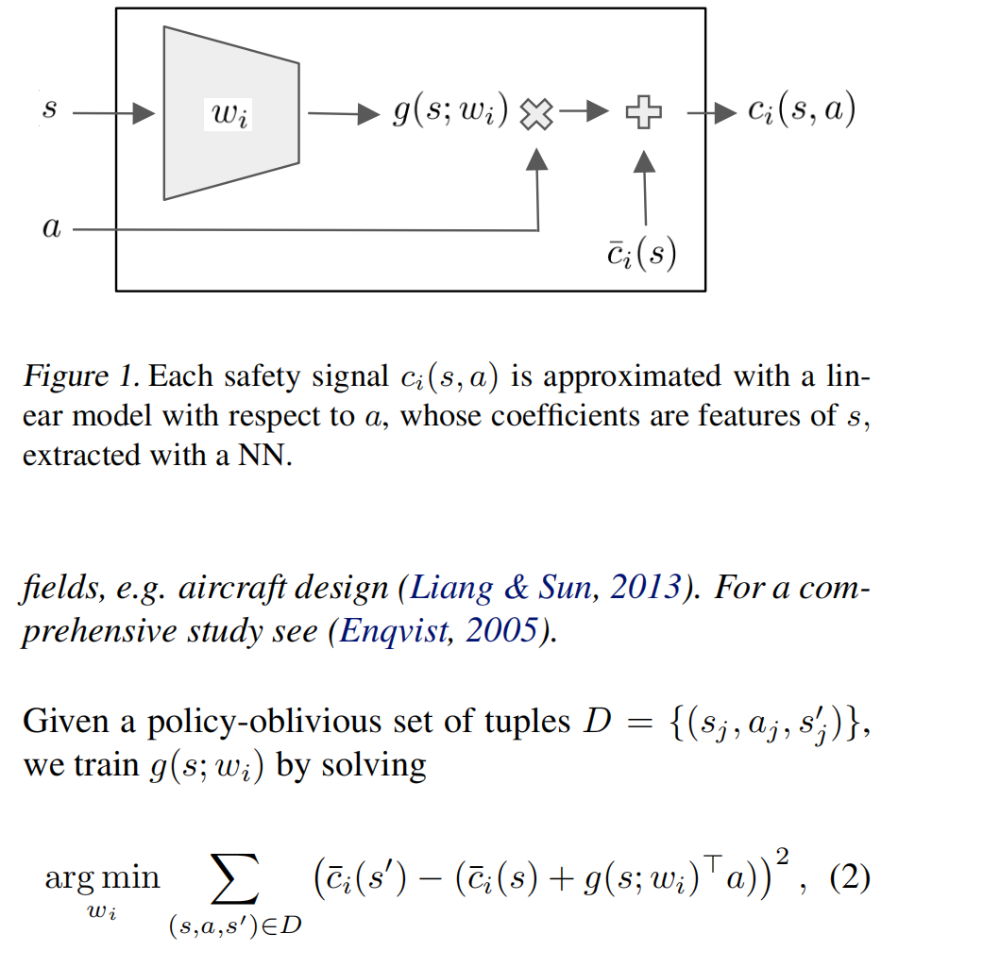
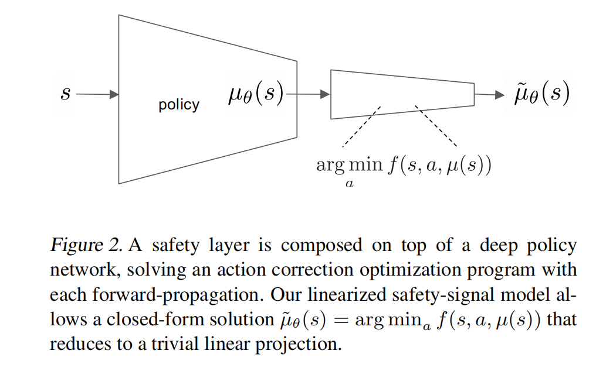
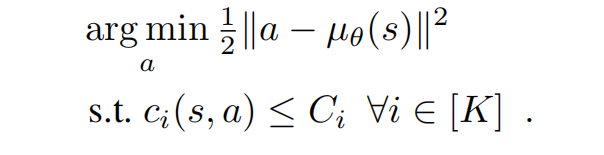
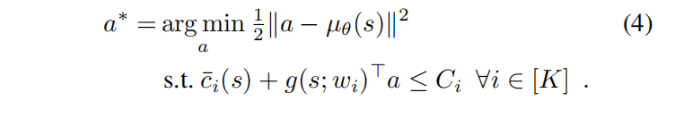
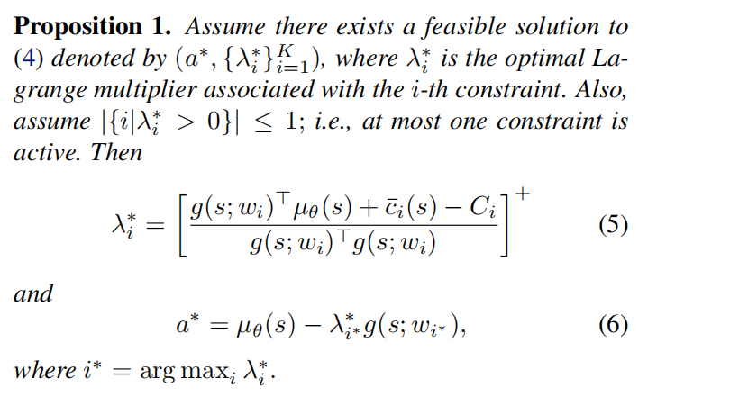
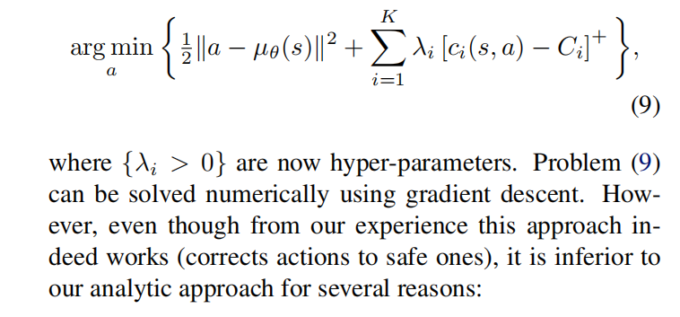
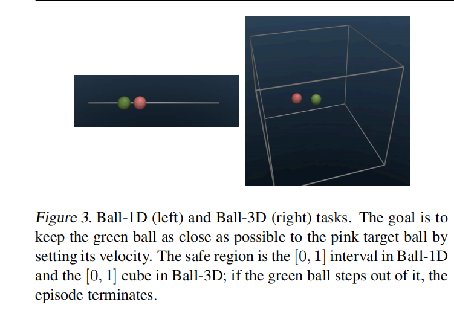
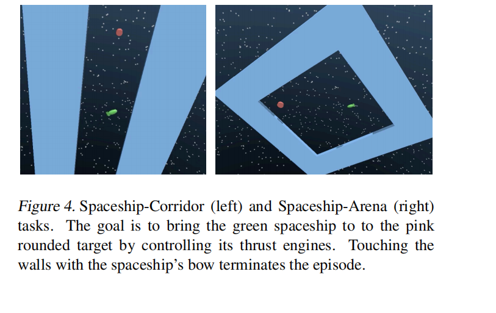
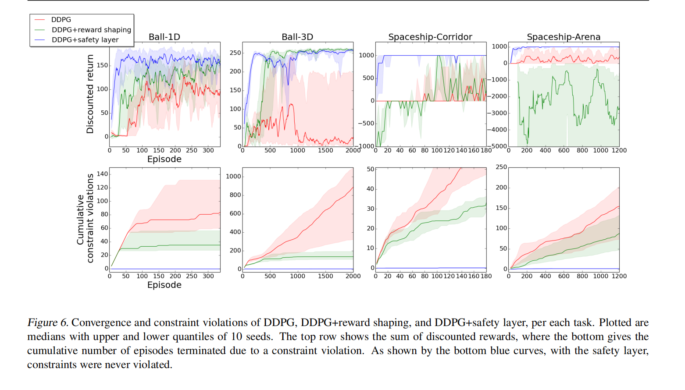

# 适用的场景
一些物理环境，工业场景。因为DDPG是确定性策略，safe layer是一种修正，应该不适合有多种最优策略的情况。这个方法基于一个假设，即在无限制的最优策略附近可以找到有限制的最优策略。

# 概念
关于代价（cost）的一些概念。

To illustrate, if $c1(s, a)$ is
the temperature in a datacenter to be sensed after choosing
a in s, c¯1(s
0 ) is the same temperature sensed in s
0 after transitioning to it. In the type of systems tackled in this work,
P is deterministic and determines f s.t. s
0 = f(s, a). Thus,
we have c¯i(s
0 ) , ci(s, a). For a general non-deterministic
transition kernel, c¯i(s
0 ) can be defined as the expectation
over s
0 ∼ P(·|s, a).

# Linear Safety-Signal Model

让智能体在真实环境中，根据随机策略来采样，一个回合以到达时间限制或触犯限制条件为结束条件。

训练方法，最小化平方误差。

这一部分的训练作为预训练的一部分，发生在强化学习训练之前，主要是要获得cost函数

#  Safety Layer via Analytical Optimization

safe layer的目标

用上面的cost定义可以转化为

把拉格朗日函数转化为对偶问题求解

# 另一个求解办法
直接让c(s,a)由一个NN来表示，lamda为超参数

缺点主要有计算量大，收敛慢，不稳定（不同a的c的梯度之间数量级差异大）

# 实验
实验的时候，会保守地收缩一下约束的Bound,这样让agent能更安全地修正策略。

## Ball Domain
控制绿球的速度来尽可能靠近红球，约束为不能碰墙。

## Spaceship Domain
控制绿色飞船的引擎的出力（前后左右四个方向）来尽可能靠近红色飞船。

## 实现细节
最终结果对safety signal model的参数不敏感。

让采样策略按照固定的概率分布来采样，训练出来的safety signal model优于随机的采样策略，但是safety layer的性能不如随机策略

## 和reward shaping对比
reward shaping就是人工地设置一些奖励，比如很大的负数，来避免触犯限制，在上面的实验环境中，就是给边界的领域设置负数奖励。

safety layer可以做到0违反限制

