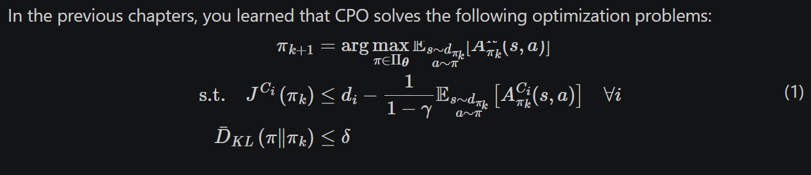
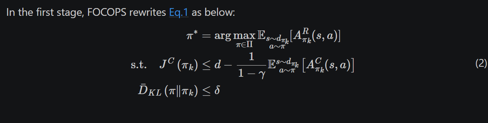
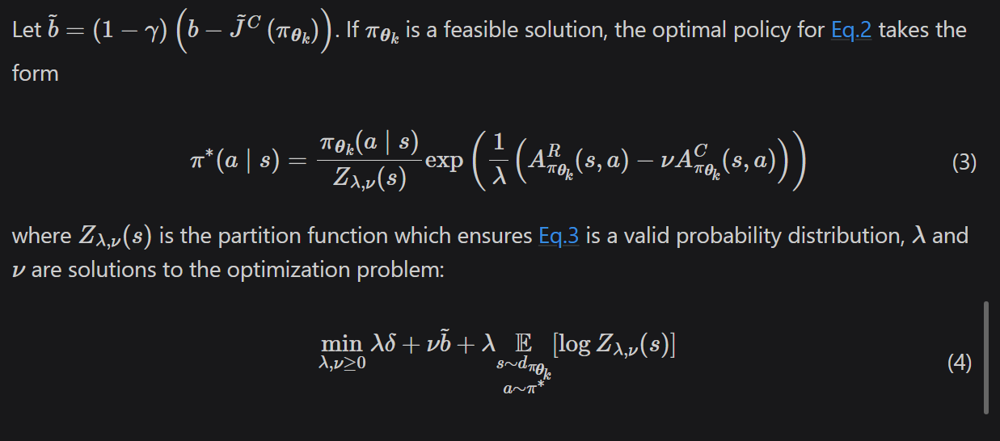
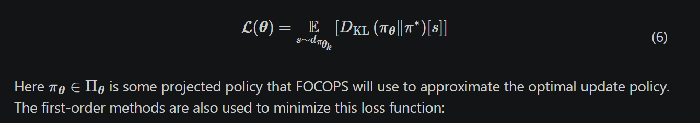
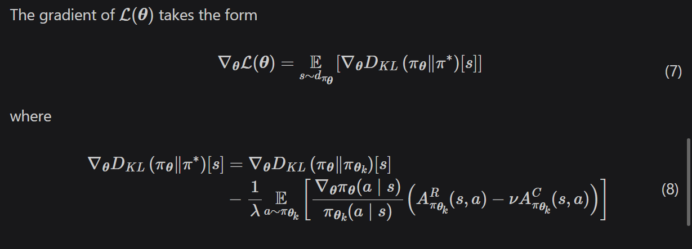

# quick facts
* on policy
* 连续与离散空间都可
* first order
  
# background
CPO的缺点：
* 从当前策略采样
* 泰勒近似误差
* 共轭方法的近似误差

FOCOPS优点：
* 简单一阶
* 避免泰勒近似和共轭方法
* 无需恢复

# Two-stage Policy Update

## stage 1 Finding the Optimal Update Policy
CPO的优化目标

FOCOPS的优化目标

区别在于FOCOPS用非参数化策略而不是参数化策略

## stage 2 Approximating the Optimal Update Policy

上一阶段得到是非参数化的策略，这一阶段就要通过最小化loss把该策略投影到参数化策略空间

update:

实验发现固定λ效果更好，而v需要更新：

λ类似于温度系数，可以调整探索程度

v是代价惩罚系数，所以需要更新，当满足约束的时候，会比较小，如果违反约束，则变大。

# comparison
作者提到和PCPO相比，FOCOPS的优势在于一阶，并且PCPO未必总是优于CPO

