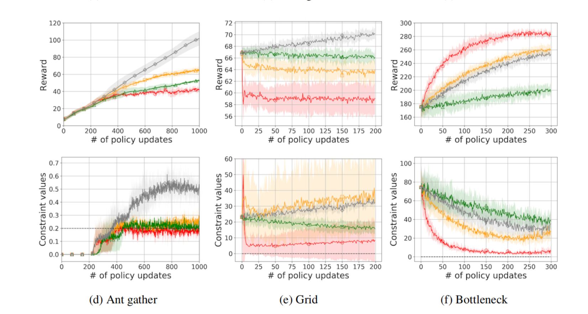

# quick facts

# detail
先找到最优解，再修正

## stage 1 Reward Improvement Stage
用TRPO最大化优势奖励

## stage 2 Projection Stage
和safety layer类似，一种修正的思想

## Policy Performance Bounds
最坏情况下约束限制

满足约束

不满足约束

## 对于距离D的选择
参数空间：L2范数

概率空间：KL散度

L2范数更容易满足约束，但是不稳定

L2范数和KL散度最终收敛的点不同，不同的任务上，各有优劣

# Question

## Q1 线性近似是否能够确保满足约束
只要δ够小，就可以局部近似

## Q2 是否适用多约束情况
可以，通过顺序投影到每一个约束集上，更新公式可以用交替投影来更新

# 和CPO的对比
CPO同时考虑置信域和限制，使用线性搜索来选择步长，如图

当违反限制的时候，CPO通过一种减法来恢复

可能导致学习速度很慢

# 实验结果
比CPO更少的违反限制

PDO在奖励优化上太保守

FPO需要很大精力来选择一个合适的λ，而PCPO不需要超参数调整。

综上，PCPO更健壮

# 本机复现
跑了1/5总步数的效果

