# Background
## SAC-Lag
直接使用SAC+Lagrangian

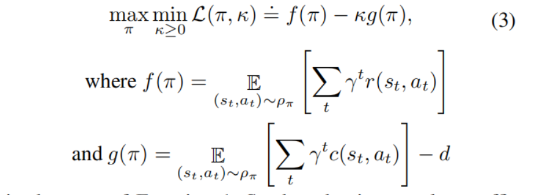

k是拉格朗日乘子，通过：

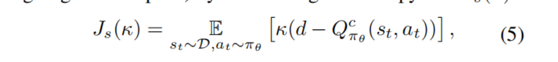

来更新

## drawbacks
SAC-Lag学习的是期望，而期望满足约束未必是严格的满足约束，实际上还是会有一些违反约束的情况。

# Worst-Case Soft Actor Critic

## Distributional safety-critic
安全约束上不再是仅仅学习Q，还会去学习Variance,从而学习cost的分布。

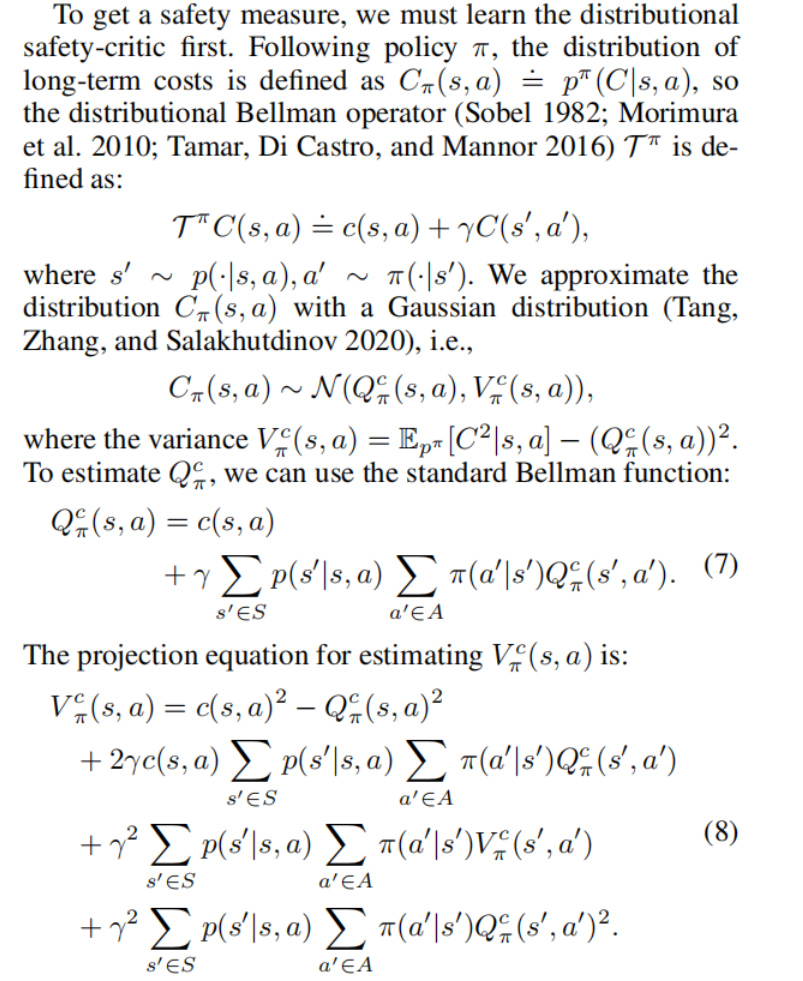

## Safety-critic learning
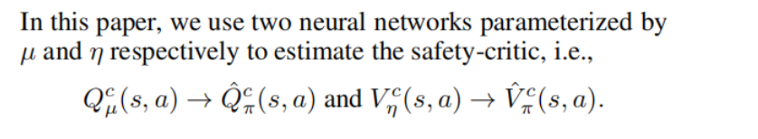

计算safety-critic的loss用simplified 2-Wasserstein distance

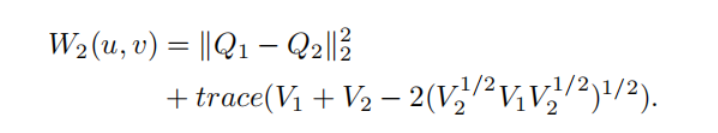

其中u ∼ N (Q1, V1), v ∼ N (Q2, V2)

得到Q,V的损失函数
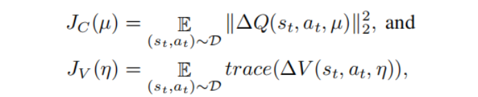
ΔQ为：

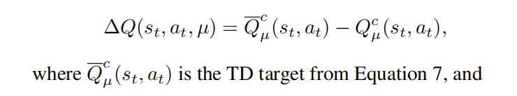

ΔV为：
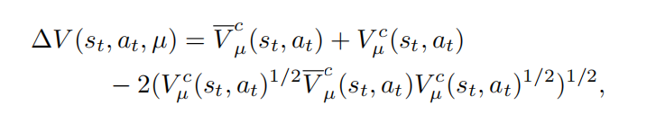

### Wasserstein Distance
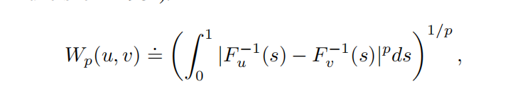
参考文章
> https://zhuanlan.zhihu.com/p/58506295

特点：
* 能够很自然地度量离散分布和连续分布之间的距离；
* 不仅给出了距离的度量，而且给出如何把一个分布变换为另一分布的方案；
* 能够连续地把一个分布变换为另一个分布，在此同时，能够保持分布自身的几何形态特征；

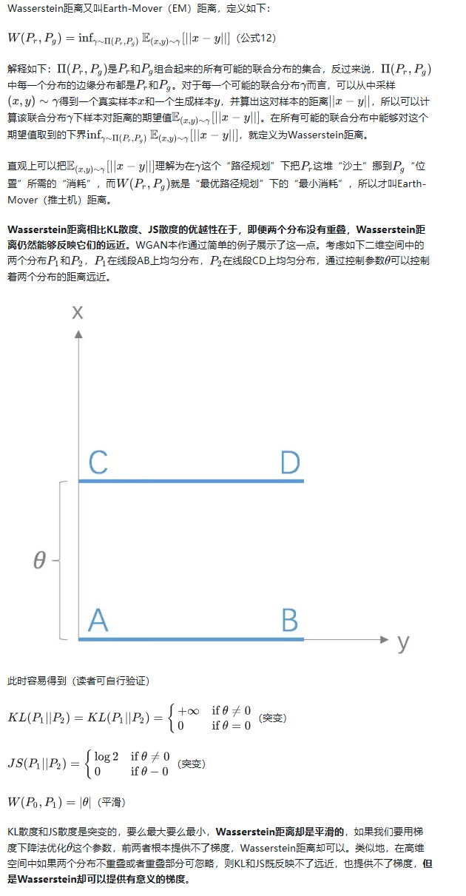

## Safety based on CVaR
CVaR refers to Conditional Value-at-Risk

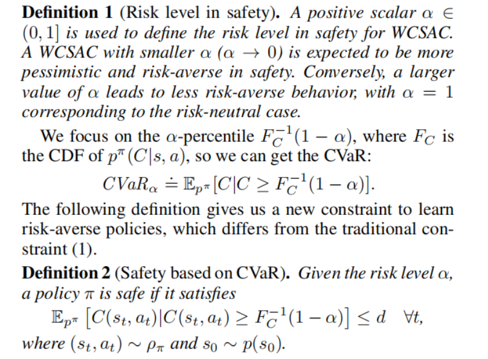

α控制安全的敏感程度，α越大，对安全越不敏感

definition 2里直接改写了约束的公式，

下图解释了worst case的含义

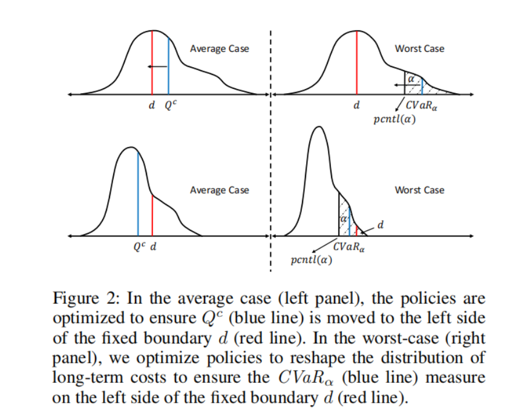

横轴是long-term cost C,纵轴是概率密度

## Worst-case actor
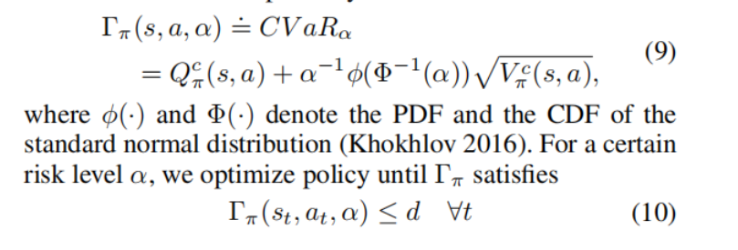

用KL散度更新policy

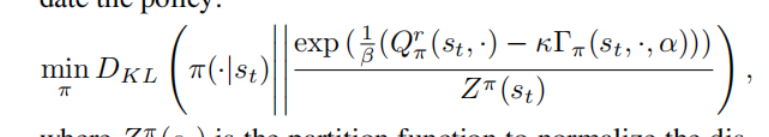

一番推导得到

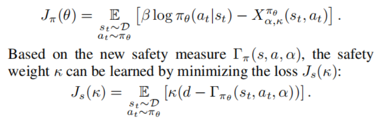

完整算法

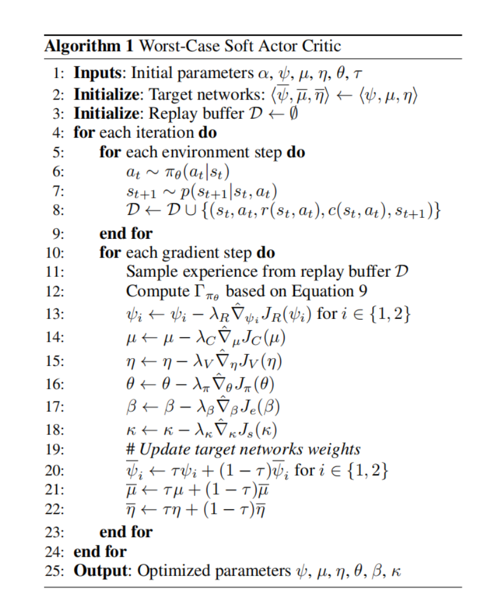

# conclusion
  * cost函数不仅学习期望，学习的是分布
  * 距离选择了2-Wasserstein distance（2维沃瑟斯坦度量）
  * 改写了约束公式，并且安全系数可以靠α来调整
